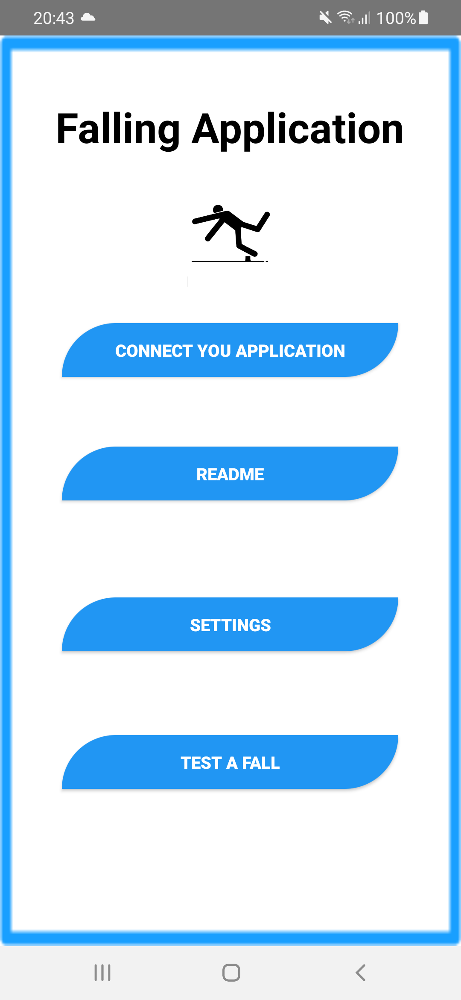
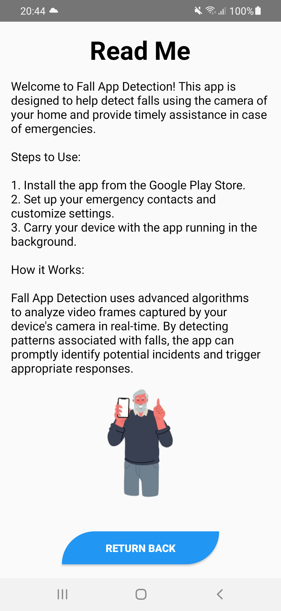
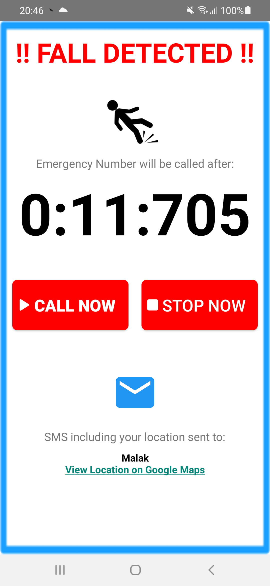
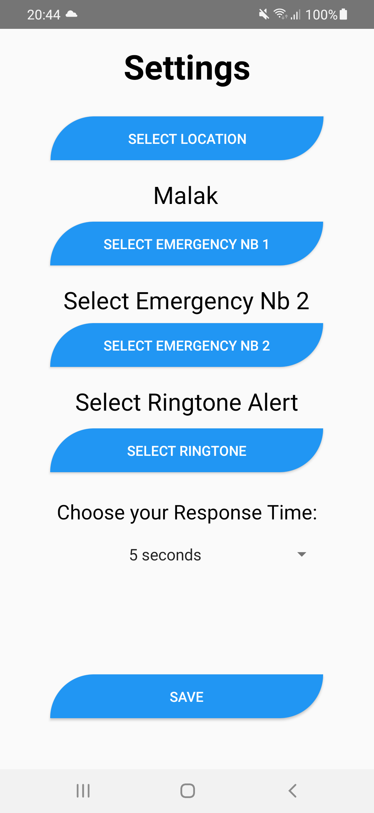

# Fall-Detection

 Fall detection system using computer vision techniques and mobile application development. 
 We employed computer vision algorithms to detect falls from video streams. 
 Then implemented a mobile application to notify caregivers or emergency services in case of a fall 
 Also we connected the mobile app with the model when a fall is detected using Firebase Cloud Messaging
 
 
  
 
<b>You can read our report submitted above <b>

